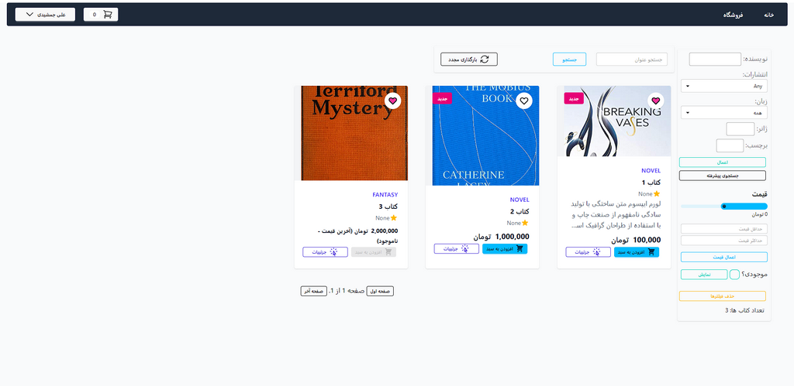
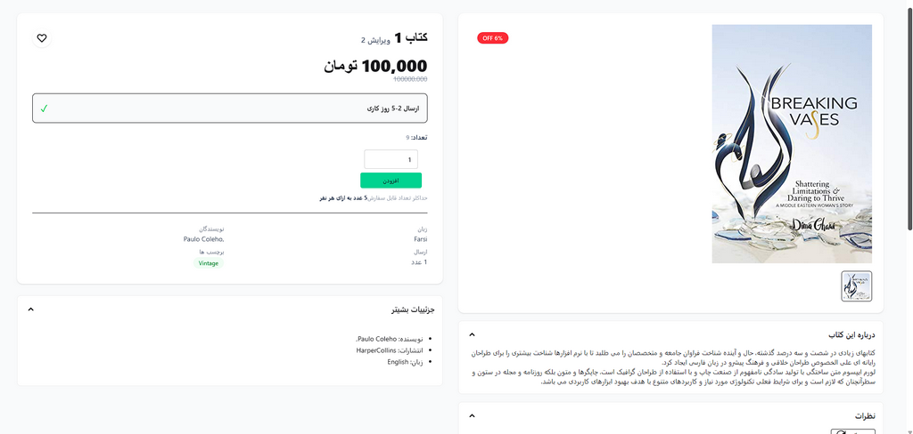
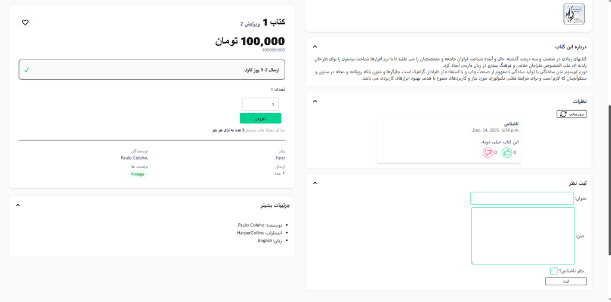

# Online Bookstore Project

### Work in progress...

### Contents:
* [Description](#description)
* [Tech Stack](#tech-stack)
* [Features](#features)
* Project structure
* [Testing](#testing)
* How to run?
* [Screenshots](#screenshots)


### Description:

### Tech Stack
* **Backend**: 
    * Django v5.2

* **Frontend**: 
    * TailwindCSS v4.1
    * DaisyUI v5.0
    * HTMX v2.0.5
    * JQuery v3.7.1

* **Database**:
    * SQLite (dev)
    * PostgreSQL (prod)


### Features
* **Session-based Authentication**
* **Custom User Model + Profile model**
* **Image Upload**
* **CRUD**
* **Database Relationships**
* **Custom Permissions**
* **Tests & Test Fixtures**

### Testing
```
# clone repository
git clone https://github.com/ark948/bookstore-project.git

# create a virtual environment and activate it (may differ according to your OS)
python -m venv .venv
.venv/Scripts/activate

# install requirements
pip install -r requirements.txt

# navigate to backend folder and run tests using pytest
cd backend
pytest
```

### Screenshots
###### Books List (Also known as Catalogue or Browse page)

###### Books details page (Product details page)

###### Books details page with comments and info cards open

